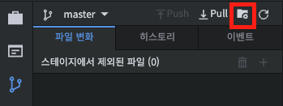

# Ignore

여러분의 프로젝트에서 버전 관리를 안하고 싶은 파일들이 있나요? 그렇다면 Ignore 명령어를 이용하세요. 더 이상 Status 명령어 실행시 나타나지 않게 할 수 있습니다.

**왼쪽 레이아웃 > 소스코드관리** 우측 상단에 '**설정**' 버튼을 누른 후 **ignore관리** 탭을 선택합니다.

<figure><figcaption></figcaption></figure>

**Git이 트래킹하지 않을 파일을 이곳에 명시**해주세요.

<figure><figcaption></figcaption></figure>

Ignore 명령어는 에러 로그 또는 자동 생성되는 파일 등에 적용하면 좋습니다. 단, **이미 Git이 버전 관리를 하고 있는 파일이라면(저장소에 추가되었다면) 무시되지 않습니다.** Git이 이미 알고 있기 때문에 무시할 수가 없습니다.
