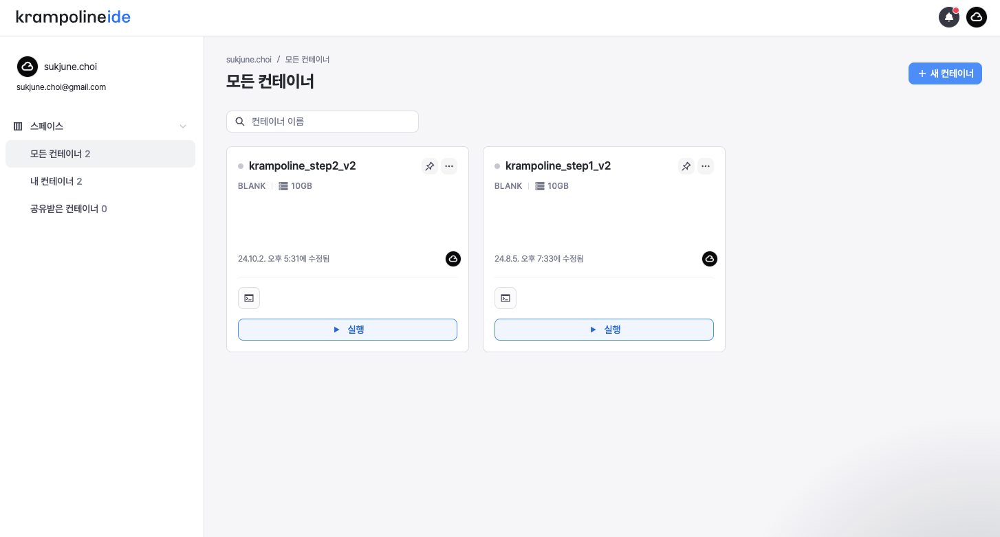

# 기본 구성에 포함된 쿠버네티스 구조

### 기본 구성에 포함된 쿠버네티스 구조

크램폴린 IDE를 이용한 배포는 카카오의 쿠버네티스 자원인 DKOS 클러스터에 이루어집니다.\
기본적으로 제공되는 구성 파일은 아래의 구조로 앱을 배포합니다.

<figure><figcaption></figcaption></figure>

Ingress, Service, Deployment, Pod 를 이용해서 어플리케이션이 구성 되어 있습니다.\
각 구성 요소에 대한 자세한 설명을 확인하고 싶다면 크램폴린 교육 사이트의 ‘DKOS와 함께 하는 쿠버네티스 튜토리얼’ 강의를 수강하시는 것을 추천드립니다.
