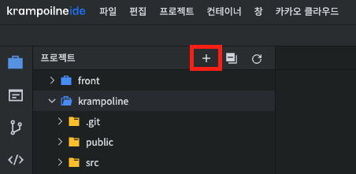

# 새로 만들기

크램폴린IDE는 다양한 유형의 확장자를 지원하며, 손쉽게 소스 파일을 구성할 수도 있습니다.

### **파일(File) / 폴더(Folder) / 텍스트 파일(Text file)**

**새 파일 / 폴저 / 텍스트 파일** 을 만들기 위해서는 **\[파일] > \[새로 만들기]** 를 클릭합니다. \
\
다른 방법으로는, **Krampoline IDE** 왼쪽 레이아웃의 프로젝트 탐색기에서 파일을 만들 위치에 우클릭을 하고 **\[새로 만들기]** 의 **하위 메뉴**를 선택합니다.&#x20;

<figure><figcaption></figcaption></figure>

<figure><figcaption></figcaption></figure>

다른 방법으로는 파일트리 상단의 `+ 버튼`을 클릭해 **파일 / 폴더 / 텍스트파일**을 생성 할 수 있습니다.

<figure><figcaption></figcaption></figure>
